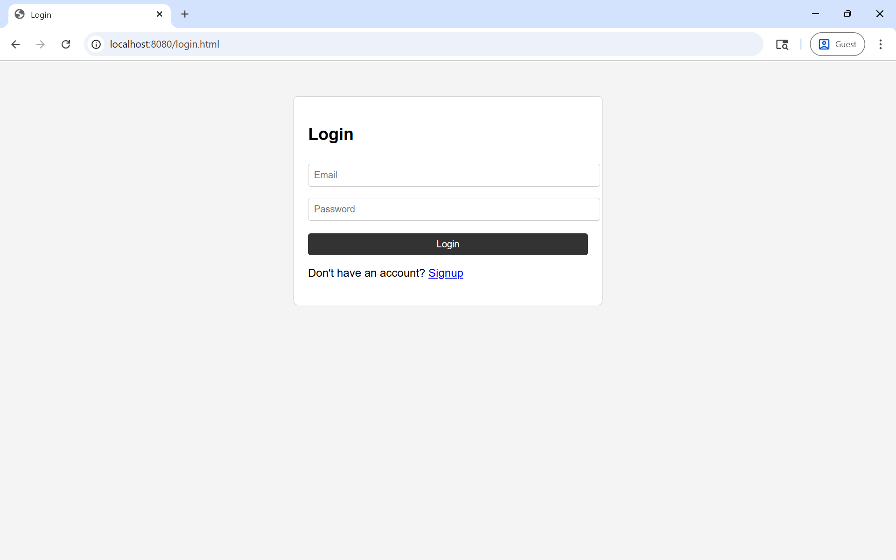
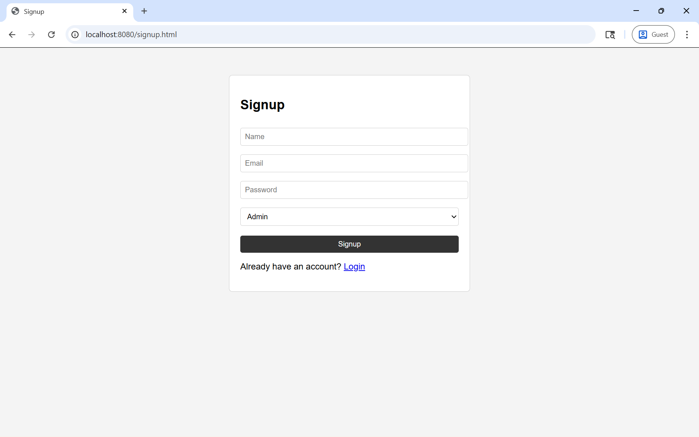
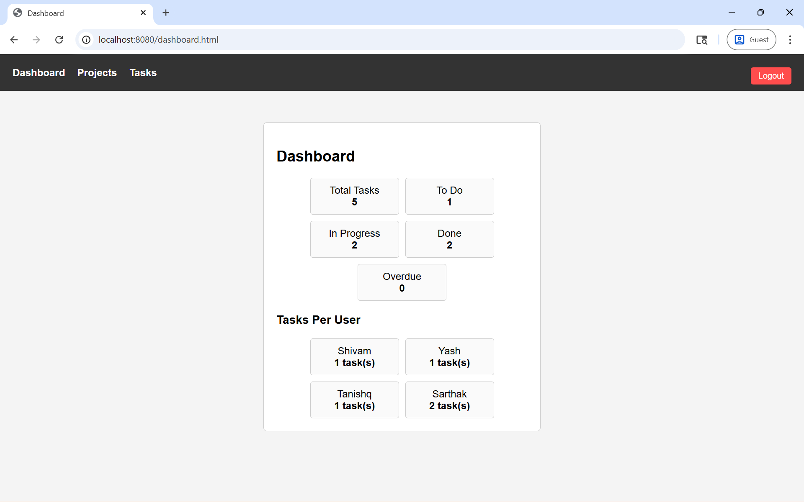
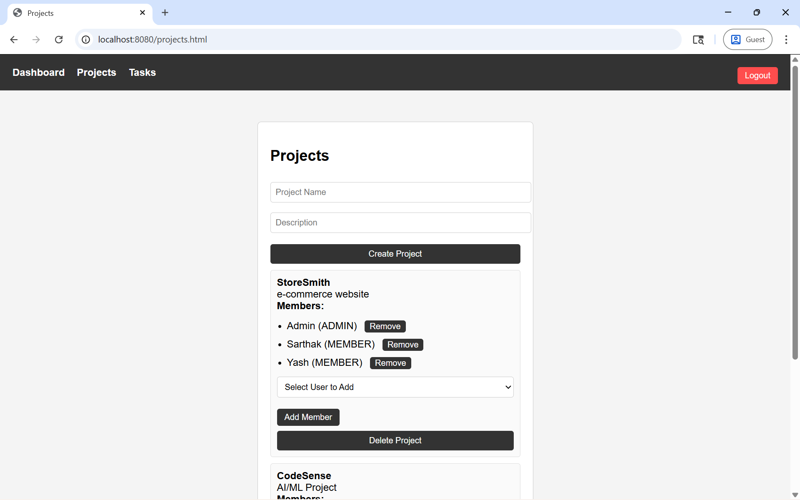
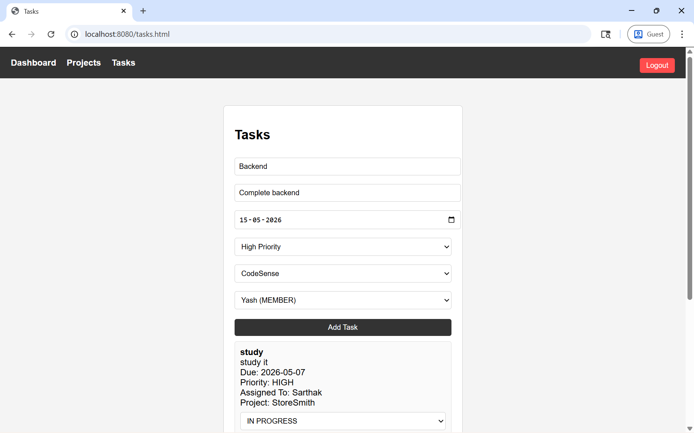

# 📋 Team Task Manager

> A full-stack **Team Task Management Web Application** inspired by tools like Trello and Asana — built with **Spring Boot**, **MySQL**, and **HTML/CSS/JavaScript**.


---

## 📸 Screenshots

### 🔐 Login Page

> *Secure login with email and password. Redirects Admin to Dashboard, Member to Projects.*

---

### 📝 Signup Page

> *Register with Name, Email, Password and select role — Admin or Member.*

---

### 📊 Dashboard (Admin Only)

> *Admin dashboard showing total tasks, status breakdown, overdue count, and tasks assigned per user.*

---

### 📁 Projects Page

> *Admin can create/delete projects and add/remove members. Members can view their assigned projects.*

---

### ✅ Tasks Page

> *Admin can create and assign tasks with priority and due date. Members can update task status.*

---


## 📌 Table of Contents

- [Features](#-features)
- [Tech Stack](#-tech-stack)
- [Project Structure](#-project-structure)
- [API Endpoints](#-api-endpoints)
- [Local Setup](#-local-setup)
- [Deployment on Railway](#-deployment-on-railway)
- [Environment Variables](#-environment-variables)
- [Role & Access Control](#-role--access-control)
- [Security](#-security)
- [Future Improvements](#-future-improvements)
- [Acknowledgments](#-acknowledgments)
- [License](#-license)

---

## 🚀 Features

### 👑 Admin
- View Dashboard with task statistics and per-user breakdown
- Create and delete Projects
- Add and remove Members from Projects
- Create Tasks with Title, Description, Due Date, and Priority
- Assign Tasks to specific Members
- Delete Tasks
- View all Tasks across all Projects

### 👤 Member
- View Projects they are assigned to
- View Tasks assigned to them
- Update Task status: `TODO` → `IN PROGRESS` → `DONE`

---

## 🛠️ Tech Stack

| Layer       | Technology                          |
|-------------|-------------------------------------|
| Backend     | Java 17, Spring Boot 3              |
| Security    | Spring Security + JWT (JJWT)        |
| Database    | MySQL 8                             |
| ORM         | Spring Data JPA / Hibernate         |
| Frontend    | HTML5, CSS3, Vanilla JavaScript     |
| Build Tool  | Maven                               |
| Deployment  | Railway                             |

---

## 📁 Project Structure

```
teamtaskmanager/
├── src/
│   ├── main/
│   │   ├── java/com/example/teamtaskmanager/
│   │   │   ├── controller/
│   │   │   │   ├── AuthController.java
│   │   │   │   ├── UserController.java
│   │   │   │   ├── ProjectController.java
│   │   │   │   ├── TaskController.java
│   │   │   │   └── DashboardController.java
│   │   │   ├── dto/
│   │   │   │   ├── AuthResponse.java
│   │   │   │   └── LoginRequest.java
│   │   │   ├── entity/
│   │   │   │   ├── User.java
│   │   │   │   ├── Project.java
│   │   │   │   └── Task.java
│   │   │   ├── repository/
│   │   │   │   ├── UserRepository.java
│   │   │   │   ├── ProjectRepository.java
│   │   │   │   └── TaskRepository.java
│   │   │   ├── security/
│   │   │   │   ├── SecurityConfig.java
│   │   │   │   ├── JwtUtil.java
│   │   │   │   └── JwtFilter.java
│   │   │   └── service/
│   │   │       ├── AuthService.java
│   │   │       ├── ProjectService.java
│   │   │       ├── TaskService.java
│   │   │       └── DashboardService.java
│   │   └── resources/
│   │       ├── static/
│   │       │   ├── css/
│   │       │   │   └── styles.css
│   │       │   ├── js/
│   │       │   │   ├── api.js
│   │       │   │   ├── auth.js
│   │       │   │   ├── common.js
│   │       │   │   ├── signup.js
│   │       │   │   ├── dashboard.js
│   │       │   │   ├── projects.js
│   │       │   │   └── tasks.js
│   │       │   ├── login.html
│   │       │   ├── signup.html
│   │       │   ├── dashboard.html
│   │       │   ├── projects.html
│   │       │   └── tasks.html
│   │       └── application.properties
├── screenshots/
├── Procfile
└── pom.xml
```

---

## ⚙️ API Endpoints

### 🔐 Auth — `/api/auth`

| Method | Endpoint            | Access | Description            |
|--------|---------------------|--------|------------------------|
| POST   | `/api/auth/signup`  | Public | Register a new user    |
| POST   | `/api/auth/login`   | Public | Login and receive JWT  |

### 📁 Projects — `/api/projects`

| Method | Endpoint                                    | Access | Description          |
|--------|---------------------------------------------|--------|----------------------|
| GET    | `/api/projects`                             | All    | Get projects         |
| POST   | `/api/projects`                             | Admin  | Create project       |
| DELETE | `/api/projects/{id}`                        | Admin  | Delete project       |
| POST   | `/api/projects/{id}/add-member/{userId}`    | Admin  | Add member           |
| DELETE | `/api/projects/{id}/remove-member/{userId}` | Admin  | Remove member        |

### ✅ Tasks — `/api/tasks`

| Method | Endpoint           | Access         | Description              |
|--------|--------------------|----------------|--------------------------|
| GET    | `/api/tasks`       | All            | Get tasks (role-based)   |
| POST   | `/api/tasks`       | Admin          | Create and assign task   |
| PUT    | `/api/tasks/{id}`  | Admin, Member  | Update task status       |
| DELETE | `/api/tasks/{id}`  | Admin          | Delete task              |

### 📊 Dashboard — `/api/dashboard`

| Method | Endpoint          | Access | Description              |
|--------|-------------------|--------|--------------------------|
| GET    | `/api/dashboard`  | Admin  | Get dashboard statistics |

### 👥 Users — `/api/users`

| Method | Endpoint      | Access | Description      |
|--------|---------------|--------|------------------|
| GET    | `/api/users`  | All    | Get all users    |

---

## 💻 Local Setup

### ✅ Prerequisites

- Java 17+
- Maven 3.8+
- MySQL 8+
- Git
- IDE — Eclipse or IntelliJ IDEA

---

### Step 1 — Clone the Repository

```bash
git clone https://github.com/your-username/teamtaskmanager.git
cd teamtaskmanager
```

---

### Step 2 — Create MySQL Database

Open MySQL Workbench or terminal and run:

```sql
CREATE DATABASE team_task_manager;
```

---

### Step 3 — Configure application.properties

Open `src/main/resources/application.properties`:

```properties
spring.application.name=teamtaskmanager

spring.datasource.url=jdbc:mysql://localhost:3306/team_task_manager
spring.datasource.username=root
spring.datasource.password=your_password_here

spring.jpa.hibernate.ddl-auto=update
spring.jpa.show-sql=true
spring.jpa.properties.hibernate.dialect=org.hibernate.dialect.MySQLDialect
```

---

### Step 4 — Build the Project

```bash
mvn clean install
```

---

### Step 5 — Run the Application

```bash
mvn spring-boot:run
```

---

### Step 6 — Open in Browser

| Page      | URL                                          |
|-----------|----------------------------------------------|
| Signup    | http://localhost:8080/signup.html            |
| Login     | http://localhost:8080/login.html             |
| Dashboard | http://localhost:8080/dashboard.html         |
| Projects  | http://localhost:8080/projects.html          |
| Tasks     | http://localhost:8080/tasks.html             |

> Hibernate auto-creates all database tables on first run.

---

## 🚂 Deployment on Railway

### ✅ Prerequisites

- [Railway account](https://railway.app/) — free tier available
- Project pushed to a GitHub repository

---

### Step 1 — Push Code to GitHub

```bash
git init
git add .
git commit -m "initial commit"
git remote add origin https://github.com/your-username/teamtaskmanager.git
git push -u origin main
```

---

### Step 2 — Create a New Project on Railway

1. Go to [railway.app](https://railway.app/) and log in
2. Click **New Project**
3. Select **Deploy from GitHub repo**
4. Authorize Railway and choose your repository

---

### Step 3 — Add MySQL Plugin

1. Inside your Railway project, click **+ New**
2. Select **Database → Add MySQL**
3. Railway auto-provisions MySQL and generates these variables:
   - `MYSQLHOST`, `MYSQLPORT`, `MYSQLDATABASE`, `MYSQLUSER`, `MYSQLPASSWORD`

---

### Step 4 — Update application.properties

```properties
spring.application.name=teamtaskmanager

spring.datasource.url=jdbc:mysql://${MYSQLHOST}:${MYSQLPORT}/${MYSQLDATABASE}
spring.datasource.username=${MYSQLUSER}
spring.datasource.password=${MYSQLPASSWORD}

spring.jpa.hibernate.ddl-auto=update
spring.jpa.show-sql=true
spring.jpa.properties.hibernate.dialect=org.hibernate.dialect.MySQLDialect

server.port=${PORT:8080}
```

---

### Step 5 — Add a Procfile

Create a file named `Procfile` (no extension) in the project root:

```
web: java -jar target/teamtaskmanager-0.0.1-SNAPSHOT.jar
```

Ensure `pom.xml` packages as `jar`:

```xml
<packaging>jar</packaging>
```

---

### Step 6 — Commit and Push

```bash
git add .
git commit -m "configure for Railway deployment"
git push
```

Railway auto-deploys on every push. Monitor build logs in the Railway dashboard.

---

### Step 7 — Get Your Public URL

Once deployed, Railway gives you a URL like:

```
https://teamtaskmanager-production.up.railway.app
```

---

### Step 8 — Update Frontend API Base URL

In `js/api.js`:

```javascript
const BASE_URL = "https://teamtaskmanager-production.up.railway.app/api";
```

In `js/auth.js` and `js/signup.js`, update all `fetch()` URLs to use the same Railway domain. Then push again:

```bash
git add .
git commit -m "update frontend base URL for production"
git push
```

---

## 🌐 Environment Variables

| Variable          | Description               | Example                  |
|-------------------|---------------------------|--------------------------|
| `MYSQLHOST`       | MySQL host from Railway   | `containers.railway.app` |
| `MYSQLPORT`       | MySQL port                | `3306`                   |
| `MYSQLDATABASE`   | Database name             | `railway`                |
| `MYSQLUSER`       | Database username         | `root`                   |
| `MYSQLPASSWORD`   | Database password         | `auto-generated`         |
| `PORT`            | Server port from Railway  | `8080`                   |

---

## 🔐 Role & Access Control

| Feature              | Admin | Member             |
|----------------------|-------|--------------------|
| View Dashboard       | ✅    | ❌                 |
| Create Project       | ✅    | ❌                 |
| Delete Project       | ✅    | ❌                 |
| Add/Remove Members   | ✅    | ❌                 |
| View Projects        | ✅    | ✅ (assigned only) |
| Create Task          | ✅    | ❌                 |
| Assign Task          | ✅    | ❌                 |
| Delete Task          | ✅    | ❌                 |
| View Tasks           | ✅    | ✅ (assigned only) |
| Update Task Status   | ✅    | ✅ (assigned only) |

---

## 🔒 Security

- Passwords hashed with **BCrypt** before storing in the database
- All `/api/**` routes (except `/api/auth/**`) require a valid **JWT Bearer token**
- JWT is validated on every request via a custom `JwtFilter`
- JWT stored in browser `localStorage`
- Role checks enforced on both **frontend** (page protection) and **backend** (service layer)
- CSRF protection disabled (stateless JWT-based API)

---

## 🔮 Future Improvements

- [ ] Email verification on signup
- [ ] Password reset via email
- [ ] Task comments and activity log
- [ ] File attachments on tasks
- [ ] Pagination and search/filter for tasks and projects
- [ ] Notification system for task assignments and due dates
- [ ] Docker support for easier local and cloud deployment
- [ ] Unit and integration tests (JUnit + Mockito)

---

## 🙏 Acknowledgments

- [**Spring Boot**](https://spring.io/projects/spring-boot) — for making Java backend development fast and productive
- [**Spring Security**](https://spring.io/projects/spring-security) — for robust authentication and authorization support
- [**JJWT (Java JWT)**](https://github.com/jwtk/jjwt) — for simple and reliable JWT generation and parsing
- [**Hibernate / Spring Data JPA**](https://hibernate.org/) — for seamless ORM and database interaction
- [**MySQL**](https://www.mysql.com/) — for reliable relational data storage
- [**Railway**](https://railway.app/) — for easy cloud deployment with managed MySQL
- [**Lombok**](https://projectlombok.org/) — for reducing boilerplate in Java entity classes
- [**Trello**](https://trello.com/) and [**Asana**](https://asana.com/) — for inspiring the concept and feature set of this application
- [**MDN Web Docs**](https://developer.mozilla.org/) — for frontend JavaScript and Fetch API reference

---

## 📄 License

This project is developed for academic and assignment purposes.  
Feel free to use, modify, and build upon it.
